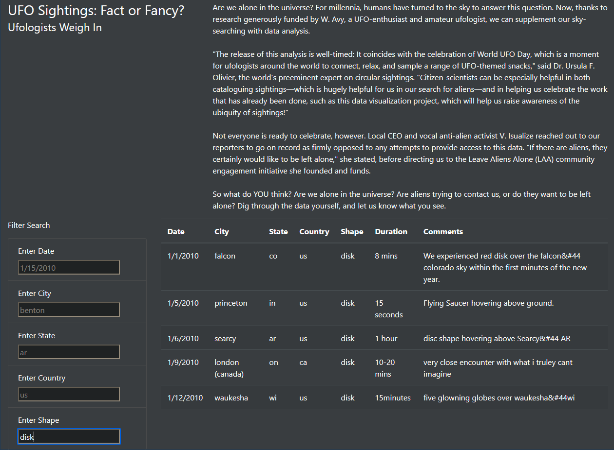

# UFOs
## Overview
The purpose of this project was to use my javascript and html/css skills to build a basic website with a filterable table. The website is for a fictional UFO enthusiast and data journalist named Dana. She wants to create a webpage to display some UFO sightings data (data.js) and feature her article.

## Results
This section explains how a user might interact with the webpage.

A user who interacts with this webpage will probably read the article first (it is fairly short) and then poke around the data table. They may, for example, want to see all of the UFO sightings that reported a disk-like shape. This is shown below.

The filters take effect one at a time after either clicking away from the input field, or hitting "Enter" on the keyboard. In order to clear a filter, the previous input must be deleted.

## Summary
While the webpage is functional and has some basic styling added, it could use some improvements.
- Display the article title on top of the article instead of to the side, to use up less unnecessary space
- Add 'clear' buttons next to each filter and a 'clear all' button next to 'Filter Search' for ease of use
